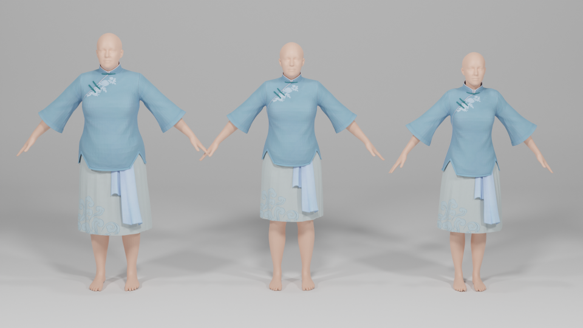

# 3D Virtual Try-On
This is a simple implementation of 3D virtual try-on that tailors garments to different human body shapes and addresses garment-body penetration issues.
<div style="width: 70%; text-align: center; margin:auto;">
    <br>
</div>

## Installation
```
conda create -n vto_3d python=3.8
conda activate vto_3d

# Install pytorch
pip install torch==1.11.0+cu113 torchvision==0.12.0+cu113 torchaudio==0.11.0 --extra-index-url https://download.pytorch.org/whl/cu113

# Install pytorch3d
pip install fvcore iopath 
pip install --no-index --no-cache-dir pytorch3d -f https://dl.fbaipublicfiles.com/pytorch3d/packaging/wheels/py38_cu113_pyt1110/download.html


# Install other dependencies
pip install -r requirements.txt

```

Install mesh processing libraries from [MPI-IS/mesh](https://www.baidu.com) .

## Run Fitting
```
python main.py --body ./data/body/female_hres_0_0.obj  --garment ./data/garment/garment_test.obj
```

## License
See `LICENSE` for more information.

## Acknowledgment
This work is based on the following open-source project of [vto-learning-based-animation](https://github.com/isantesteban/vto-learning-based-animation). Thanks for their excellent code! 
